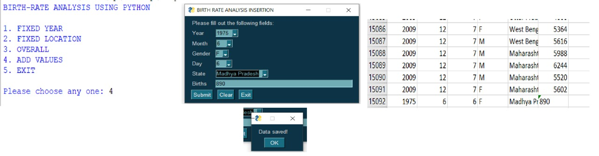
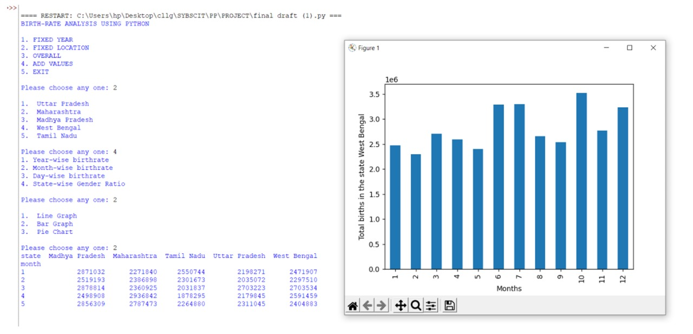
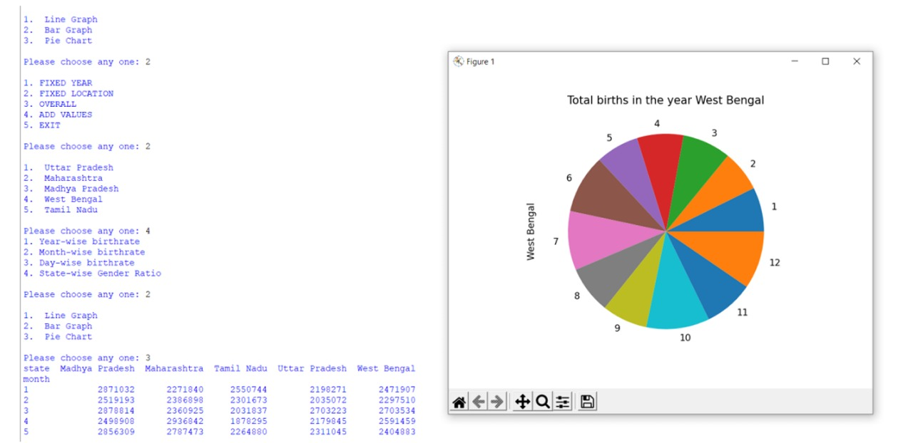
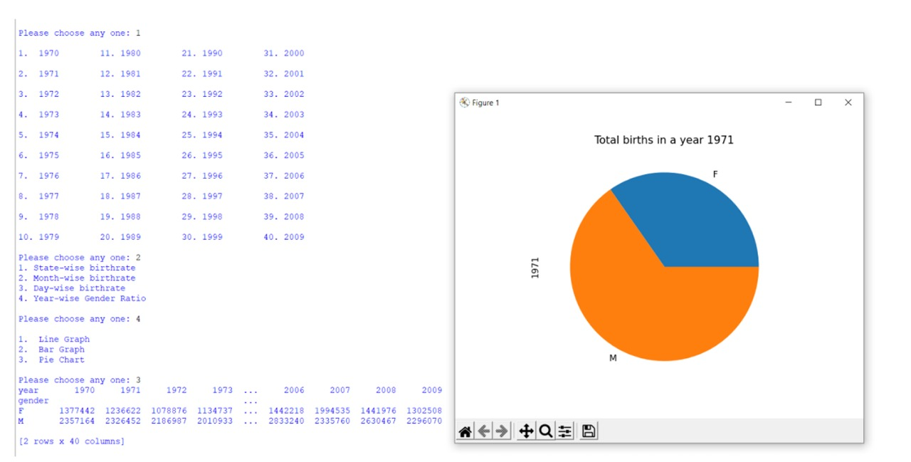
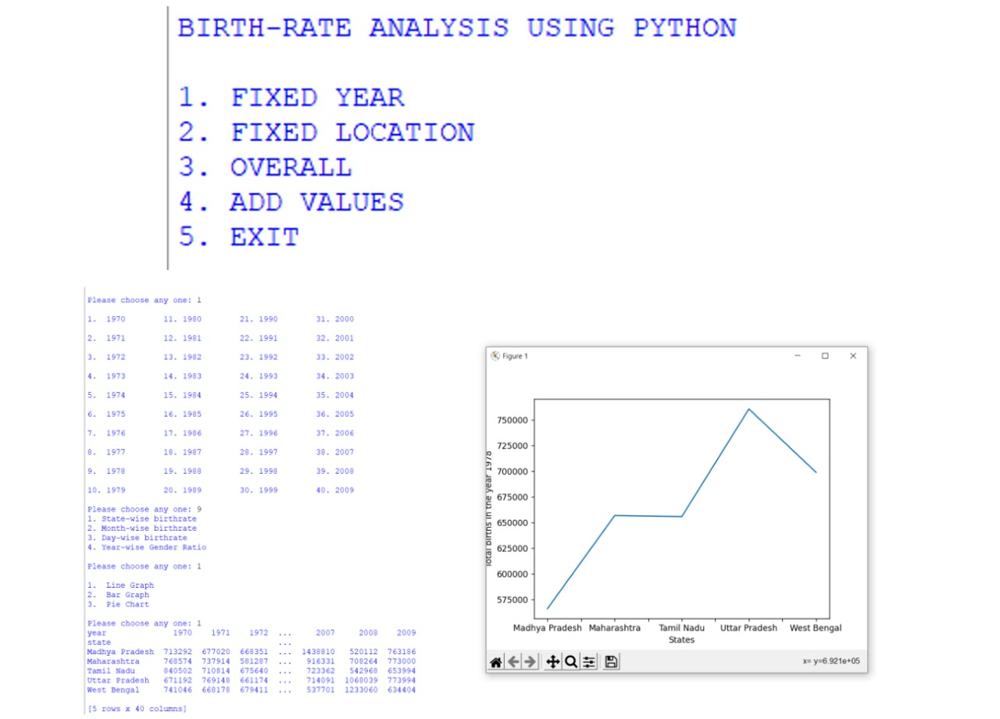
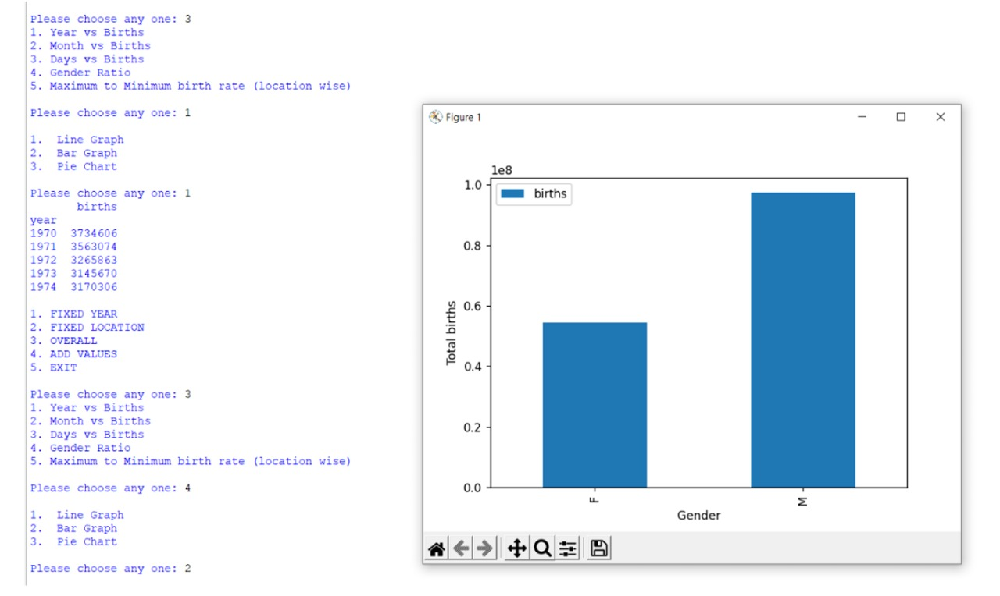
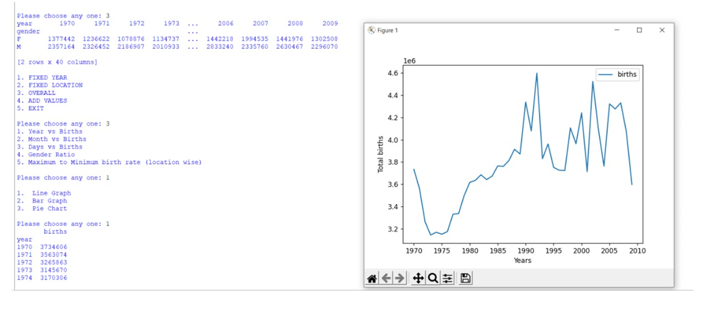

# Birth Rate Analysis - Python Project

## 📊 Description
A Python-based project that analyzes birth rate data using Excel files, performs visualizations, and presents key insights. Built using libraries like `pandas`, `matplotlib`, and `tkinter`.

## 🔧 Features
- Excel file integration
- Pivot table analysis
- Visualizations using Matplotlib
- GUI with Tkinter and PySimpleGUI

## 🛠️ Technologies Used
- Python
- Pandas
- Matplotlib
- Tkinter
- PySimpleGUI

## 🚀 How to Run
1. Clone the repo or download the ZIP
2. Run `FINAL DRAFT.py` using Python 3

## 📁 Files
- `FINAL DRAFT.py`: Main Python script
- `birthrate.xlsx`: Sample dataset

## 📸 Sample Visualizations

### GUI Window for Data Entry

### Fixed Location – Month-wise Bar Graph

### Fixed Location – Month-wise Pie Chart

### Fixed Year – Month-wise Gender Pie Chart

### Fixed Year – State-wise Line Graph

### Overall – Gender-wise Bar Graph

### Overall – Month-wise Line Graph

## ✍️ Author
[Akanksha Yadav](https://github.com/ay03)
